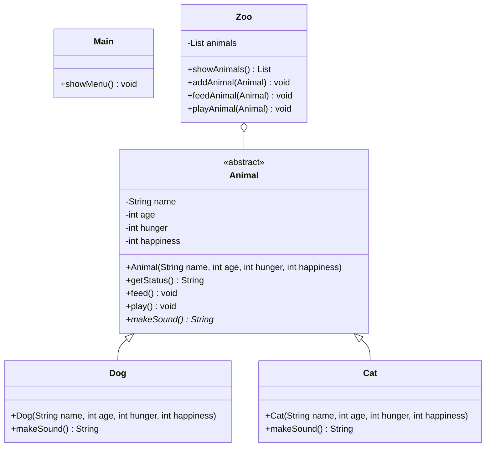

```mermaid
classDiagram
    class Main{
        +showMenu() void
    }
    
    class Zoo{
        -List<Animal> animals
        +showAnimals() List<Animal>
        +addAnimal(Animal) void
        +feedAnimal(Animal) void
        +playAnimal(Animal) void
    }
    
    class Animal{
        <<abstract>>
        -String name
        -int age
        -int hunger
        -int happiness
        +Animal(String name, int age, int hunger, int happiness)
        +getStatus() String
        +feed() void
        +play() void
        +makeSound()* String
    }
    
    class Dog{
        +Dog(String name, int age, int hunger, int happiness)
        +makeSound() String
    }

    class Cat{
        +Cat(String name, int age, int hunger, int happiness)
        +makeSound() String
    }
    Zoo o-- Animal
    Animal <|-- Dog
    Animal <|-- Cat

```